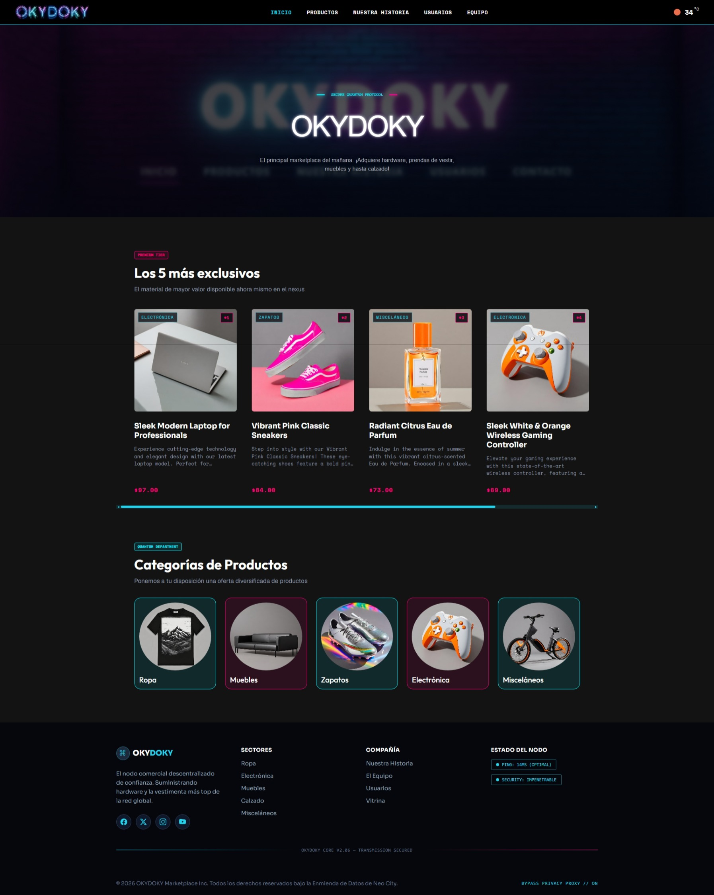
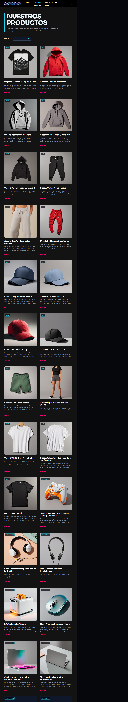
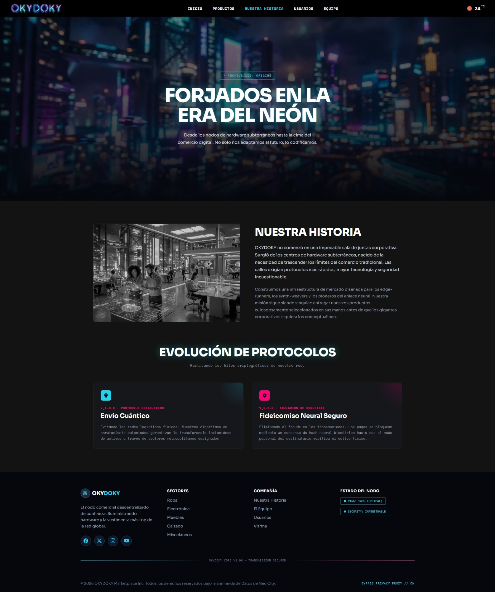
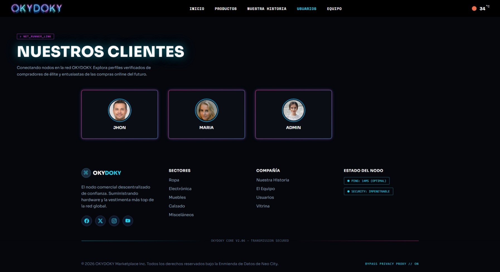
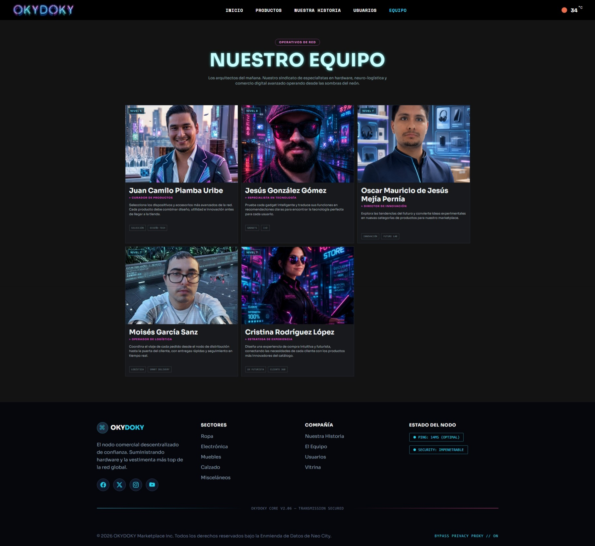
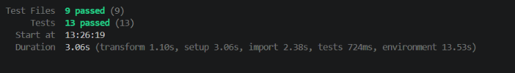

# OKYDOKY · el marketplace del mañana

Catálogo online de hardware, moda, muebles y calzado con una identidad visual cyberpunk. Proyecto de bootcamp construido con **React 19** y **Vite 8**.

**[→ Ver la tienda en vivo](https://tienda-online-okydoky.vercel.app/)**


---

## ⌁ Índice

| El producto | Bajo el capó | Puesta en marcha |
| --- | --- | --- |
| [Descripción](#-descripción) | [Stack tecnológico](#-stack-tecnológico) | [Requisitos previos](#-requisitos-previos) |
| [Demo](#-demo) | [Arquitectura](#-arquitectura-del-proyecto) | [Instalación](#-instalación) |
| [Capturas](#-capturas) | [Mapa de rutas](#-mapa-de-rutas) | [Variables de entorno](#-variables-de-entorno) |
| [Características](#-características) | [Integraciones y datos](#-integraciones-y-datos) | [Comandos](#-comandos-disponibles) · [Tests](#-tests) |
| [Estética](#-estética-del-sistema) | [Equipo](#-equipo) · [Licencia](#-licencia) | [Despliegue](#-despliegue) |

---

## ▚ Descripción

**OKYDOKY** es una SPA (_single page application_) construida con **React 19** y **Vite 8** como proyecto de bootcamp. Presenta un catálogo de productos consumido en tiempo real desde una API externa, con filtrado por categorías, páginas informativas sobre la marca y un widget de clima opcional basado en geolocalización.

Toda la interfaz gira en torno a una identidad visual coherente: superficies oscuras, rejilla de tarjetas, tipografías `Sora` + `Space Mono` y dos acentos neón (cian y magenta) que atraviesan botones, bordes y estados. La navegación se gestiona con **React Router** sobre un layout compartido, y cada vista maneja sus propios estados de carga, éxito y error.

---

## ▚ Demo

| Recurso | Enlace |
| --- | --- |
| 🌐 Aplicación desplegada | **[tienda-online-okydoky.vercel.app](https://tienda-online-okydoky.vercel.app/)** |
| 💾 Repositorio | **[github.com/oscarmmejia/tiendaOnline](https://github.com/oscarmmejia/tiendaOnline)** |

---

## ▚ Capturas

> Imágenes tomadas sobre la aplicación en ejecución.

### `> INICIO`
Hero principal, productos destacados y acceso a las categorías del catálogo.



### `> CATÁLOGO`
Encabezado, selector de categoría y rejilla de resultados en vivo.



### `> NUESTRA HISTORIA`
Narrativa de marca y evolución de sus protocolos.



### `> USUARIOS`
Perfiles de la comunidad conectada a OKYDOKY.



### `> EQUIPO`
Los cinco integrantes que construyen el sistema.



---

## ▚ Características

- 🛰️ **Catálogo en vivo** — productos obtenidos desde la Platzi Fake Store API y normalizados antes de pintarse.
- 🔍 **Filtrado por categoría** — selector sincronizado con parámetros de URL (`?categoryId=`).
- ✨ **Catálogo curado** — descarta productos con imágenes _placeholder_ o descripciones demasiado cortas, dejando solo fichas de calidad.
- 🏆 **Destacados** — selección de los productos de mayor precio para el _hero_ de inicio.
- 🧩 **Tarjetas reutilizables** — imagen, categoría, descripción y precio en un componente único.
- 📖 **Nuestra historia** — página editorial con el origen y la evolución de la marca.
- 👥 **Usuarios** — perfiles de la comunidad servidos desde la API externa.
- 🛠️ **Equipo** — presentación de los cinco integrantes y sus roles.
- 🌦️ **Widget de clima opcional** — geolocalización + OpenWeather, activable por variable de entorno.
- ♻️ **Peticiones cancelables** — `AbortController` + axios evitan actualizar componentes desmontados.
- ⏳ **Estados asíncronos** — `loading` / `ready` / `error` gestionados de forma centralizada.
- 🧭 **Layout compartido** — header, footer y _scroll-to-top_ automático al cambiar de ruta.
- 🚫 **Página 404** — fallback para cualquier ruta no definida.
- 📱 **Responsive** — la rejilla y el _padding_ se adaptan por _breakpoints_.

---

## ▚ Estética del sistema

La identidad visual vive en `src/index.css` como _design tokens_. Esta es la paleta que define el mundo OKYDOKY:

| Token | Hex | Rol |
| --- | --- | --- |
| `--colorBackground` | `#05070d` | Fondo base (casi negro) |
| `--colorSurface` | `#0f172a` | Superficies y tarjetas |
| `--colorBorder` | `#334155` | Bordes y separadores |
| `--colorText` | `#ffffff` | Texto principal |
| `--colorTextMuted` | `#8a95a5` | Texto secundario |
| `--colorCyan` | `#22d3ee` | Acento primario (neón cian) |
| `--colorMagenta` | `#ff007a` | Acento secundario (neón magenta) |

**Tipografías:** `Sora` para display · `Space Mono` para código y detalles técnicos.

---

## ▚ Stack tecnológico

| Capa | Tecnología |
| --- | --- |
| **UI** | React 19 · React DOM 19 |
| **Enrutado** | React Router DOM 7 |
| **Build / Dev** | Vite 8 |
| **HTTP** | Axios 1.20 (cliente centralizado) |
| **Compilación** | React Compiler vía Babel + Rolldown |
| **Estilos** | CSS modular por componente + tokens globales |
| **Calidad** | ESLint 10 |
| **Lenguaje** | JavaScript (ES Modules) |

**APIs externas:** [Platzi Fake Store API](https://api.escuelajs.co/api/v1) · [OpenWeather API](https://openweathermap.org/api)

---

## ▚ Arquitectura del proyecto

```text
src/
├── assets/                 # Recursos estáticos (hero background)
├── components/
│   ├── atoms/              # Piezas base reutilizables
│   ├── molecules/          # Composiciones pequeñas
│   ├── organisms/          # Bloques complejos de interfaz
│   ├── templates/          # MainLayout (header + footer + outlet)
│   ├── header/             # Cabecera y navegación
│   ├── footer/             # Pie de página
│   ├── hero/               # Hero de inicio
│   ├── categoryCard/       # Tarjeta de categoría
│   ├── titleDescription…/  # Bloque de título + descripción
│   ├── users/              # Vista y tarjetas de usuarios
│   └── weather/            # Widget meteorológico
├── constants/
│   └── requestStatus.js    # Estados loading / ready / error
├── hooks/
│   ├── useProductCatalog.js
│   ├── useTopProducts.js
│   ├── useUsers.js
│   ├── useWeather.js
│   └── useScrollToTop.js
├── img/                    # Imágenes de historia y equipo
├── pages/
│   ├── homePage/
│   ├── productsPage/
│   ├── ourStoryPage/
│   ├── team/
│   └── notFoundPage/
├── routes/
│   └── routePaths.js       # Rutas centralizadas
├── services/
│   ├── httpClient.js       # Instancia axios + helper de cancelación
│   ├── productsApi.js      # Productos y categorías (curado + normalizado)
│   ├── userService.js      # Usuarios
│   └── weatherService.js   # OpenWeather
├── styles/                 # Estilos compartidos
├── test/                   # Suite de tests (ver sección Tests)
│   ├── unit/               # Servicios y constantes
│   ├── components/         # Componentes aislados
│   ├── integration/        # Páginas y router completos
│   ├── utils/              # Helpers de render
│   └── vitest.config.js    # Configuración del runner
├── App.jsx                 # Configuración del router
├── main.jsx                # Punto de entrada
├── setupTests.js           # Setup global de Vitest (matchers de jest-dom)
└── index.css               # Tokens y estilos base
```

**Flujo de datos:** `service` (axios) → `hook` (estado + cancelación) → `page` / `component` (render por estado). Los servicios devuelven datos ya **normalizados**, de modo que la capa visual solo se preocupa de pintar.

---

## ▚ Mapa de rutas

| Ruta | Vista | Descripción |
| --- | --- | --- |
| `/` | Inicio | Hero, destacados y categorías |
| `/productos` | Catálogo | Todos los productos |
| `/productos?categoryId=1` | Catálogo filtrado | Resultados por categoría |
| `/nuestra-historia` | Nuestra historia | Narrativa de marca |
| `/usuarios` | Usuarios | Perfiles de la comunidad |
| `/equipo` | Equipo | Integrantes y roles |
| `*` | 404 | Fallback de ruta no encontrada |

---

## ▚ Requisitos previos

- **Node.js** 18 o superior
- **npm** 9 o superior
- Conexión a internet (los datos provienen de APIs externas)

---

## ▚ Instalación

```bash
# 1 · Clona el repositorio
git clone https://github.com/oscarmmejia/tiendaOnline.git

# 2 · Entra en el proyecto
cd tiendaOnline

# 3 · Instala las dependencias
npm install

# 4 · Arranca el entorno de desarrollo
npm run dev
```

Vite mostrará una URL local (por defecto **http://localhost:5173**). Ábrela en el navegador y el sistema estará online. ⚡

---

## ▚ Variables de entorno

El widget de clima es **opcional**. Para activarlo, crea un archivo `.env` en la raíz:

```env
VITE_OPENWEATHER_API_KEY=tu_api_key_de_openweather
```

> Sin esta clave, la tienda funciona con total normalidad; el widget simplemente indicará que la API no está configurada. **Nunca subas tu `.env` al repositorio.**

---

## ▚ Comandos disponibles

| Comando | Acción |
| --- | --- |
| `npm run dev` | Servidor de desarrollo con Vite |
| `npm run build` | Compilación de producción en `dist/` |
| `npm run preview` | Sirve localmente la _build_ de producción |
| `npm run lint` | Análisis de código con ESLint |
| `npm test` | Tests en modo _watch_ con Vitest |
| `npm run test:run` | Ejecuta la suite de tests una vez (CI) |

---

## ▚ Integraciones y datos

**Platzi Fake Store API** — `https://api.escuelajs.co/api/v1`
Productos, categorías y usuarios. La capa de servicios **filtra y normaliza** la respuesta: descarta imágenes _placeholder_, exige una descripción mínima y limita el catálogo a las categorías destacadas — **Ropa · Electrónica · Muebles · Zapatos · Misceláneos**.

**OpenWeather API** — widget meteorológico opcional.
Solicita permiso de geolocalización al navegador y consulta el clima con la variable `VITE_OPENWEATHER_API_KEY`, devolviendo solo temperatura, descripción e icono.

Todas las peticiones pasan por un **cliente axios centralizado** (`httpClient.js`) y son cancelables mediante `AbortController`, evitando fugas de estado al desmontar componentes.

---

## ▚ Tests

La suite se ejecuta con **Vitest 4** sobre un entorno **jsdom**, usando **Testing Library** para interactuar con los componentes como lo haría una persona: buscando por rol, etiqueta o texto visible en lugar de por clases CSS o estructura interna.

> `> 9 archivos · 13 tests · sin llamadas reales a la red`

### Stack de testing

| Herramienta | Rol |
| --- | --- |
| **Vitest 4** | _Test runner_, aserciones (`expect`) y mocks (`vi`) |
| **jsdom 30** | Simula el DOM del navegador en Node |
| **@testing-library/react 16** | Renderizado de componentes y consultas accesibles |
| **@testing-library/jest-dom 7** | Matchers de DOM (`toBeInTheDocument`, `toHaveAttribute`…) |

### Estructura

Toda la suite vive en `src/test/`, y el setup global que la acompaña en `src/setupTests.js`:

```text
src/
├── setupTests.js                 # Setup global: matchers de jest-dom
└── test/
    ├── vitest.config.js          # Configuración del runner (jsdom, globals, include)
    ├── utils/
    │   └── renderWithRouter.jsx  # Helper: render envuelto en MemoryRouter
    ├── unit/                     # Lógica pura: servicios y constantes
    │   ├── httpClient.test.js
    │   ├── productsApi.test.js
    │   └── requestStatus.test.js
    ├── components/               # Componentes aislados (atoms / molecules / organisms)
    │   ├── categoryTag.test.jsx
    │   ├── productCard.test.jsx
    │   ├── productGrid.test.jsx
    │   └── productPrice.test.jsx
    └── integration/              # Páginas y router completos
        ├── productsPage.test.jsx
        └── routing.test.jsx
```

Los tests viven **fuera** de `src/components` y `src/services` para que el árbol de la aplicación quede limpio; la ruta de cada archivo espeja la del módulo que prueba.

### Cómo ejecutarlos

| Comando | Acción |
| --- | --- |
| `npm test` | Modo _watch_: re-ejecuta al guardar cambios |
| `npm run test:run` | Ejecuta la suite completa una vez y termina (ideal para CI) |
| `npm run test:run -- productsApi` | Filtra por nombre de archivo |
| `npm run test:run -- -t "filters invalid"` | Filtra por nombre de test |

> Todos los comandos apuntan a `src/test/vitest.config.js` mediante el flag `--config`, así que **no funcionan sin él**: usa siempre los scripts de `package.json` en lugar de invocar `vitest` a secas.

### `> Resultado`
Salida esperada con la suite en verde.



### Configuración

`src/test/vitest.config.js` define el entorno de ejecución:

```js
test: {
  environment: 'jsdom',                  // DOM simulado
  globals: true,                         // describe / it / expect sin importar
  setupFiles: ['./src/setupTests.js'],   // matchers de jest-dom
  include: ['./src/test/**/*.test.{js,jsx}'],
}
```

El plugin `@vitejs/plugin-react` se carga aquí para que el JSX de los tests se transforme igual que en la aplicación.

### Qué cubre cada capa

| Suite | Verifica |
| --- | --- |
| `requestStatus.test.js` | Que los estados `loading` / `ready` / `error` no cambien de forma silenciosa |
| `httpClient.test.js` | Que `isRequestCanceled` distinga una cancelación de axios de un error real |
| `productsApi.test.js` | El **curado y normalizado** del catálogo: descarta imágenes _placeholder_, descripciones cortas y categorías fuera de la lista; ordena los destacados por precio y respeta el límite |
| `productPrice.test.jsx` | Formato de moneda (`$1,234.50`) |
| `categoryTag.test.jsx` | Render de la etiqueta de categoría |
| `productCard.test.jsx` | Que la tarjeta pinte título, descripción, precio, categoría e imagen a partir de sus props |
| `productGrid.test.jsx` | Render de una tarjeta por producto y **estado vacío** cuando no hay resultados |
| `productsPage.test.jsx` | Flujo completo de la página: carga desde el servicio, pintado de la rejilla y **filtrado por categoría** al cambiar el selector |
| `routing.test.jsx` | Que una ruta inexistente caiga en la página **404** |

### Convenciones

- 🧪 **Nombre de archivo:** `nombreDelModulo.test.js(x)`, en la carpeta que corresponda a su capa (`unit`, `components`, `integration`).
- 🔌 **Cero red real.** Los servicios se sustituyen con `vi.mock()`; cuando el mock necesita variables definidas antes del _hoisting_, se declaran con `vi.hoisted()` (ver `productsPage.test.jsx`).
- 🧭 **Componentes con enlaces o rutas** se montan con el helper `renderWithRouter`, que los envuelve en un `MemoryRouter` y acepta `initialEntries` para simular la URL de partida.
- 🎯 **Consultas accesibles primero:** `getByRole`, `getByLabelText`, `getByText`. `data-testid` queda reservado para los dobles de prueba.
- ⛓️ **Aislamiento:** `vi.clearAllMocks()` en `beforeEach` y un mock por dependencia externa; cada test debe poder ejecutarse solo.
- ⏱️ **Asincronía:** usa `findBy*` o `waitFor` para lo que llega después de una promesa; nunca esperas fijas con `setTimeout`.

### Añadir un test nuevo

```jsx
// src/test/components/miComponente.test.jsx
import { render, screen } from '@testing-library/react'
import { describe, expect, it } from 'vitest'
import MiComponente from '../../components/atoms/miComponente/MiComponente'

describe('MiComponente', () => {
  it('renderiza el texto recibido', () => {
    render(<MiComponente label="Hola" />)

    expect(screen.getByText('Hola')).toBeInTheDocument()
  })
})
```

Con `npm test` en marcha, el archivo se detecta y se ejecuta automáticamente al guardarlo.

### Cobertura de código

Aún no hay un proveedor de cobertura instalado. Para activarlo:

```bash
npm install -D @vitest/coverage-v8
npm run test:run -- --coverage
```

### Notas

- Al ejecutar la suite aparece el aviso `Not implemented: Window's scrollTo()`. Es una limitación conocida de jsdom (no implementa el _scroll_) provocada por el hook `useScrollToTop`; **no** indica un fallo y los tests siguen pasando.
- La suite no depende de las APIs externas ni de `VITE_OPENWEATHER_API_KEY`: los tests de integración simulan el widget de clima y los servicios HTTP, así que funcionan sin conexión.

---

## ▚ Despliegue

Optimizado para **Vercel** como aplicación Vite:

1. Importa el repositorio en Vercel.
2. Comando de compilación: `npm run build`.
3. Directorio de salida: `dist`.
4. (Opcional) Añade `VITE_OPENWEATHER_API_KEY` en las variables de entorno.
5. El `vercel.json` incluido reescribe todas las rutas a `index.html`, de modo que React Router funciona incluso al recargar en rutas internas.

---

## ▚ Equipo

> `> 5 nodos conectados al sistema`

- **Jesús González Gómez**
- **Juan Camilo Piamba Uribe**
- **Oscar Mauricio de Jesús Mejía Pernía**
- **Moisés García Sanz**
- **Cristina Rodríguez López**

---

## ▚ Licencia

Proyecto **académico** desarrollado para el bootcamp. Todos los derechos del código pertenecen a sus autores.
